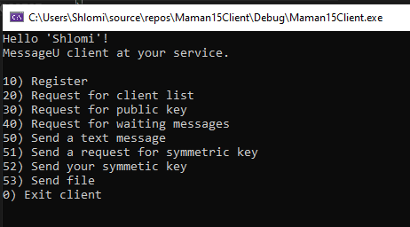
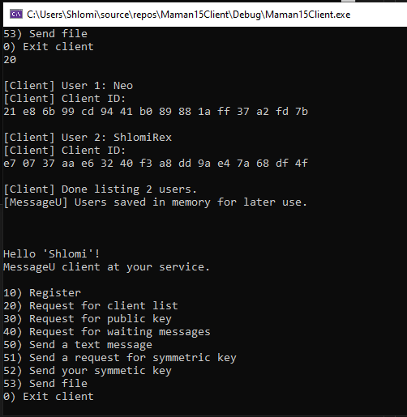
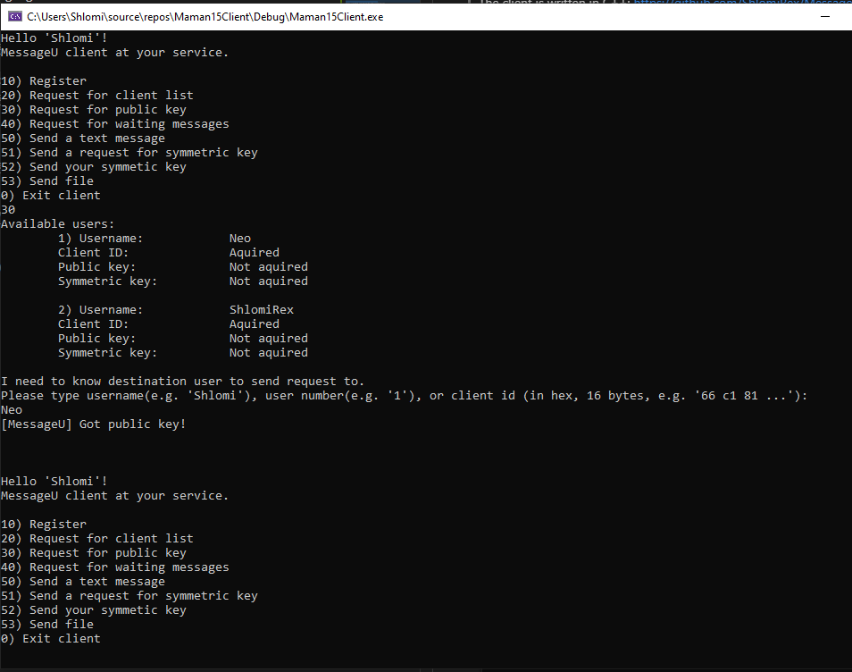
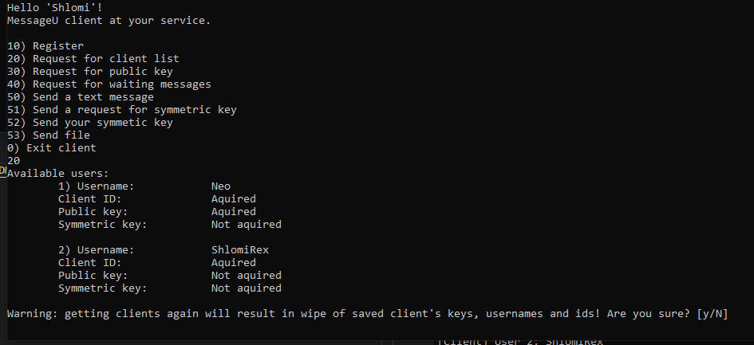
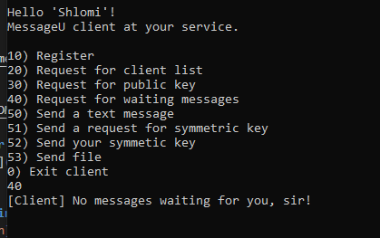
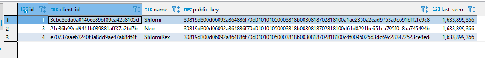
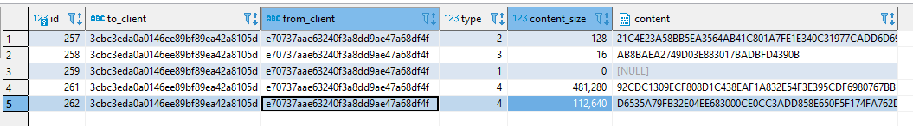
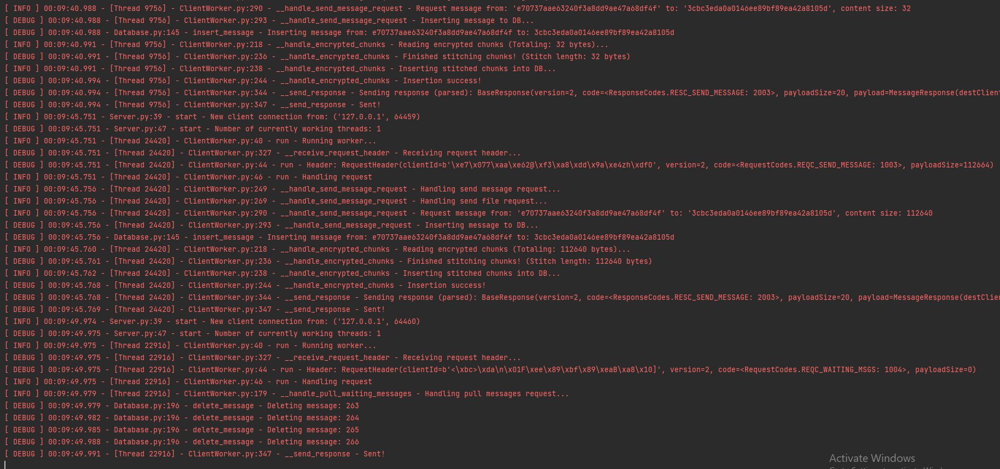

# MessageU-Server
 
MessageU is encrypted end-to-end chat and file transfer protocol. Using RSA for key exchange and AES CBS for messaging and file transfer.

The client is written in C++:
https://github.com/ShlomiRex/MessageU-Client

And the server is written in python:
https://github.com/ShlomiRex/MessageU-Server

# Environment

Client development: Visual Studio 2019 Community - Windows

Server development: Pycharm Professional 2021 - Windows + macOS

Database editor and viewer: DBeaver Community - Windows + macOS

Client C++ Libraries:

* Crypto++ 8.5.0
* Boost 1.70.0

# Screenshots - Client
## Main Menu

## Receiving list of clients

## Request public key from server

## Getting list of clients - again

## Receiving empty list of messages

## Receiving diffirent kinds of messages

# Screenshots - Server
## Server Database - Users table

## Server Database - Messages table

## Some server logs

